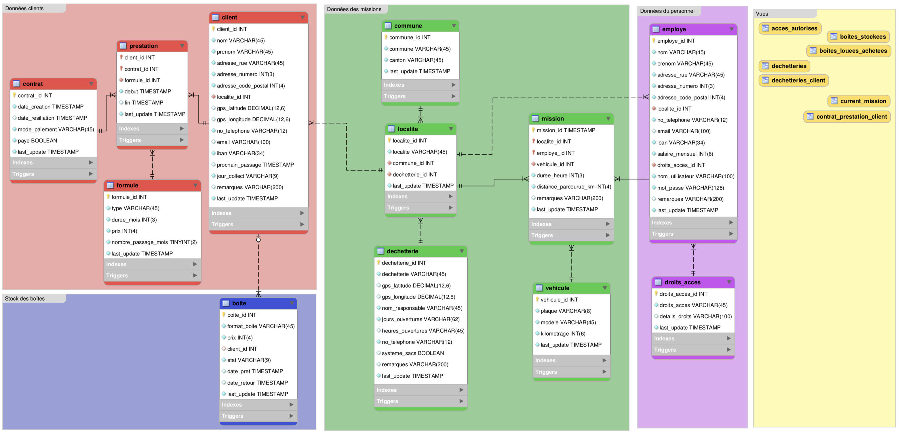
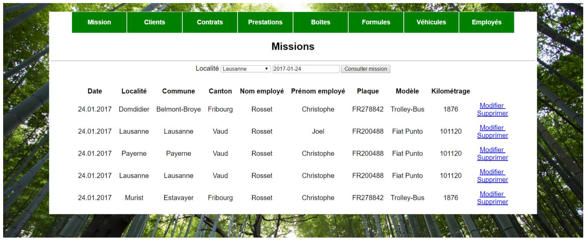
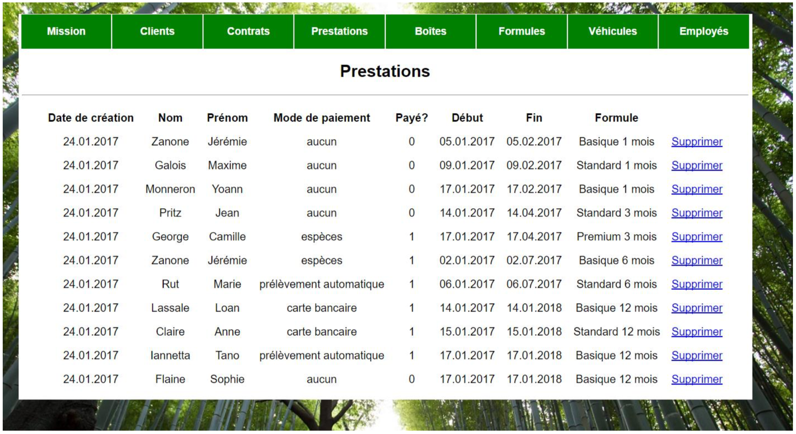

# [Oust](https://oust.ch) :: Customer and service manager of the company 

Authors: Jérémie Zanone, Loan Lassalle and Tano Iannetta
***

## Description

As part of our project we worked for a startup called [Oust!](https://oust.ch) offering a service to collect recyclable waste at home in exchange for a subscription lasting from one month to one year. Our goal is to facilitate the management of the company.

## Features

* Consult a customer and their services
* Change informations of a customer
* Add a customer with the creation of a contract and a service
* Add, change or delete a contract
* Consult clients to visit during a mission for a specific day mission history
* Manage various type of box
* Consult various service formulas
* Manage vehicles
* Consult employee informations

## Relational model

  

## Website

  

  

## Instructions for deployement of the database

1. Place the `oust` directory in the `www` directory of WAMPServer `C:\wamp\www\`
   
2. Configure the `oust/includes/include.php` file at 13th line
   `$connexion = new PDO('mysql:host=localhost; dbname=oust','username', 'password');`

3. Provide username and password of databse `localhost`, default values username = 'root' and password = ''

4. Import database from WAMP (PhpMyAdmin) directly or via MySQL Workbench by running the files in the following order:
   1. `oust/oust-database/oust-schema.sql`
   2. `oust/oust-database/oust-function.sql`
   3. `oust/oust-database/oust-data.sql`
   
5. Use web interface by opening a web browser and connecting to `localhost/oust`

6. Know a user login, login: BigBoss password: sheep

## Status
The database is 100% functional. However it is still possible to add views and triggers to add additional features and security.
- We currently only have an administrator account, which can manage the database from the web interface. The other types of accounts are present in the database but not managed by the web interface.
- Employee time fields have been removed as employee accounting is managed by an add-on program to the database. The salary is left in the table used for information purposes.
